# ARI3129 Advanced Computer Vision for AI

Saul Vassallo, Nick Gaerty, Luca D'Ascari

## Introduction

Waste management is a growing challenge in urban areas, with improper disposal leading to environmental pollution and public health concerns. Efficient waste collection and categorization are crucial for maintaining clean cities and promoting recycling efforts. In recent years, computer vision has emerged as a valuable tool in automating waste detection and classification, offering the potential to streamline waste management operations and improve efficiency.

This project focuses on the analysis of domestic waste collection on Maltese streets using computer vision techniques. The goal is to develop an object detection system capable of identifying and classifying different types of waste bags, such as mixed waste, organic waste, and recyclable materials. The project is structured into several key phases, starting with the collection and annotation of images, followed by data augmentation to enhance the dataset, and culminating in the training of object detection models using the YOLO framework, specifically versions YOLOv5,
YOLOv8, and YOLOv11. The final models will be evaluated to assess their effectiveness in accurately detecting and categorizing waste bags.

Through this project, we aim to demonstrate how artificial intelligence can be leveraged to support sustainable waste management practices, offering automated solutions that can contribute to cleaner and more efficient waste collection systems.

## Background

Object detection is a key task in computer vision, involving the simultaneous classification and localisation of objects within an image. It underpins numerous real-world applications, from autonomous vehicles to healthcare and environmental monitoring. The goal is to detect objects with high precision and speed, making it a vital component of intelligent systems. The advent of deep learning models such as YOLO (You Only Look Once) has significantly advanced object detection by balancing accuracy with real-time performance [1].

The YOLO series of models has revolutionised object detection since its introduction in 2016. Unlike traditional methods, which involve separate processes for region proposal and classification, YOLO frames detection as a single regression problem, predicting bounding boxes and class probabilities in one pass through the network. This unified approach ensures speed and efficiency, enabling YOLO to process images at impressive frame rates while maintaining competitive accuracy [2]. Over the years, enhancements in the YOLO architecture have introduced features such as anchor boxes, multi-scale predictions, and better loss functions, which have improved its robustness and scalability [3].

Recent iterations like YOLOv5, YOLOv8, and YOLOv11 have further refined the model’s capabilities. YOLOv5 incorporates automated anchor generation and mosaic data augmentation, making it highly adaptable to diverse datasets [4]. YOLOv8, on the other hand, integrates advanced feature aggregation and attention mechanisms, boosting its performance on complex datasets [5]. The YOLOv11 version builds on these advancements by adopting state-of-the-art training strategies and expanding its ability to handle challenging scenarios, such as overlapping objects and occlusions [6]. These models are widely regarded for their ability to balance computational efficiency with high detection accuracy, making them ideal for time-sensitive applications.

In addition to detection algorithms, effective dataset preparation is critical to achieving reliable results. Roboflow, a widely used platform in the computer vision community, simplifies the end-to-end dataset creation pipeline. Its powerful annotation tools leverage AI to speed up labeling while maintaining accuracy, a crucial step in training high-performing models. Furthermore, Roboflow offers built-in data augmentation techniques, such as flipping, rotation, brightness adjustments, and cropping, to increase dataset diversity and improve model generalization. These augmentations simulate real-world conditions, ensuring that models trained on augmented datasets are robust across various scenarios [7].

Roboflow also supports seamless exporting of datasets in formats compatible with machine learning frameworks such as TensorFlow, PyTorch, and YOLO, facilitating the training process. Additionally, its integration with open-source datasets provides access to a vast repository of pre-labeled data, enabling researchers to augment their datasets further without starting from scratch. These features collectively make Roboflow a cornerstone for modern object detection workflows.

Together, the YOLO models and Roboflow form a synergistic pipeline for object detection. While the YOLO family offers cutting-edge detection capabilities, Roboflow ensures that the datasets feeding these models are optimised for success. This combination addresses challenges such as class imbalance, data diversity, and model scalability, enabling high accuracy and robust performance in real-world applications.

## Data Preparation

The data preparation phase was a crucial aspect of our project, as it formed the foundation for training an accurate and unbiased object detection model. Task 1 of the assignment required us to collect, annotate, and prepare a dataset of domestic waste bags categorized into three types: mixed (black bags), recyclable (grey bags), and organic (white bags). Our goal was to ensure that the dataset was well-structured, balanced, and representative of real-world conditions, which would enable the model to generalize effectively across different environments. This section outlines the steps taken to collect, clean, annotate, and prepare the dataset for training.

**Image Collection**

To achieve a balanced dataset, we decided to collect 75 images per category, resulting in an initial dataset of 225 images. The decision to have an equal number of images for each waste category was made to prevent bias during model training, ensuring fair representation and performance across all types of waste.

The images were captured from various locations, including San Ġwann, Sliema, Swieqi, and Gżira, to introduce diversity in environmental conditions such as lighting, background, and terrain. Capturing images at different times of the day was also a key consideration, as waste collection
schedules vary across locations. To maximize the number of available waste bags, we adhered to the local waste collection schedule:

- **Organic waste (white bags):** Monday, Wednesday, and Friday.
- **Mixed waste (black bags):** Tuesday and Saturday.
- **Recycling (grey bags):** Thursday.

In areas such as Sliema, where collection occurs later in the day, images were taken during sunset, whereas for other locations, images were captured in the morning or early afternoon to align with pickup schedules. This approach ensured varied lighting conditions, which is beneficial for the model's ability to recognize waste bags in different real-world scenarios.

Additionally, to enhance efficiency during data collection, multiple images were taken of the same waste bag from different angles and backgrounds, simulating diverse environments. Another innovative approach involved carrying a waste bag to different locations and capturing images after
repositioning or slightly altering its shape to mimic natural variation.

**Image Cleaning and Organization**

Once the images were collected, they were organized into their respective categories: Organic, Mixed, and Recycling. Before proceeding with annotation, an image cleaning process was conducted. This involved reviewing all images to identify and obscure any personally identifiable
information, such as car number plates or human faces. Anything detected was covered with white markings using image editing tools to anonymize the data. Fortunately, no images contained human faces, simplifying the cleaning process.

Next, to ensure consistency in data processing, all images were resized to a standard resolution of 4032x3024 pixels. Initially, this resizing was done manually using macOS's built-in resizing tool, as we were unaware that Roboflow provided an automatic resizing option. We also ensured every image was in the same format, opting for the .jpg files. These steps ensured uniformity across the dataset, which is essential for efficient model training and evaluation.

**Annotation Process**

Following the data cleaning phase, the images were uploaded to Roboflow, a popular platform for dataset annotation and augmentation. Each image was meticulously reviewed, and bounding boxes were manually drawn around waste bags. The waste bags were classified into four classes:

- Organic (white bags)
- Mixed (black bags)
- Recycling (grey bags)
- Other (any waste that does not fit into the above categories)

To ensure high-quality annotations, careful attention was given to the accuracy of the bounding boxes, as incorrect labelling could negatively impact the model's performance.

**Data Augmentation**

Once annotation was complete, data augmentation was applied using Roboflow's built-in tools. Augmentation is essential for increasing dataset diversity and improving model robustness. The following augmentation techniques were applied:

- **Flipping:** Both horizontal and vertical flips to simulate different orientations.
- **Cropping:** Random cropping to introduce variation in positioning.
- **Zooming:** Adjusting image zoom levels.
- **Saturation:** Varying saturation levels between -25% and 25%.
- **Exposure:** Modifying exposure between -10% and 10% to simulate different lighting
  conditions.
- **Blur:** Adding Gaussian blur up to 1.5px to replicate environmental conditions.

After augmentation, the dataset size increased to 543 images,
which were split into training, validation, and test sets in a 70/20/10 ratio:

- **Train set:** 447 images
- **Validation set:** 45 images
- **Test set:** 21 images

This split was chosen to ensure the model had sufficient data for training while retaining enough samples for performance evaluation.

**Dataset Export and Preparation for Model Training**

Once the annotation and augmentation process was completed, the dataset was exported in three formats, each corresponding to a different version of the YOLO (You Only Look Once) object detection framework:

- **YOLOv5**
- **YOLOv8**
- **YOLOv11**

Exporting the dataset in multiple YOLO versions provided flexibility for experimentation and comparison in the subsequent training phase. These versions were selected to explore the improvements in detection accuracy and performance across different iterations of the YOLO framework.

This structured approach to data preparation ensured that our dataset was well-balanced, diverse, and ready for object detection model training. The comprehensive cleaning, annotation, and augmentation steps helped create a robust dataset capable of supporting accurate waste bag detection in varied environments.

## Implementation of the Object Detectors

This section outlines the implementation of three object detection models: **YOLOv5**, **YOLOv8**, and **YOLOv11n (Nano)**. Each model was trained from scratch to detect and localize waste bags in images. The training process involved preparing datasets, configuring model architectures, and optimizing performance through training and evaluation. Below, we expand on the architecture and training process for each model.

Each of the models was trained leveraging google Colab's free gpu hardware.

### 1. **YOLOv5**

**Architecture:**

- YOLOv5 is a highly efficient and popular real-time object detection framework. It employs a Convolutional Neural Network (CNN) backbone, such as CSPDarknet53, for feature extraction [8].
- The neck of the architecture utilizes Path Aggregation Network (PANet) for aggregating feature maps from different levels.
- The head consists of detection layers for predicting bounding boxes and class probabilities.

**Training Process:**

- The YOLOv5 model was trained using a PyTorch-based implementation [9].
- A dataset containing labeled images of waste bags was preprocessed using resizing and data augmentation techniques (e.g., flipping, cropping, and color jittering) to increase generalizability.
- Training was conducted on a GPU with Adam optimizer and a cosine learning rate scheduler.
- The loss function consisted of three components: objectness, classification, and bounding box regression losses.
- The model was trained for 50 epochs, and metrics such as mean Average Precision (mAP) and Precision-Recall were logged for evaluation.

### 2. **YOLOv8**

**Architecture:**

- YOLOv8, a recent addition to the YOLO family, is an improvement over its predecessors in terms of speed and accuracy. It incorporates an enhanced backbone based on CSPNet and introduces dynamic anchor boxes [10].
- The model also benefits from an improved loss function and better feature pyramids for multiscale detection.

**Training Process:**

- YOLOv8 training was performed using the Ultralytics framework in a custom Python environment [11]. The dataset underwent data augmentation similar to the YOLOv5 setup.
- The training configuration included:
  - Batch size: 16
  - Image size: 640x640
- The model was trained for 50 epochs, with checkpoints saved for performance comparison.
- Evaluation focused on the model's ability to generalize across various lighting conditions and object orientations.

### 3. **YOLOv11n (Nano)**

**Architecture:**

- YOLOv11n (Nano) is a lightweight version of the YOLOv11 model, designed for deployment in resource-constrained environments. It uses a simplified backbone and neck architecture to ensure faster inference times while maintaining acceptable detection accuracy [12].
- The model focuses on efficiency with reduced parameters, making it well-suited for detecting waste bags in real-time applications.

**Training Process:**

- A custom YOLOv11n implementation was trained using PyTorch. The training dataset was preprocessed with advanced data augmentation techniques such as mosaic augmentation and random scaling.
- The training process involved:
  - Batch size: 16
- The model was trained for 50 epochs, with checkpoints saved periodically for evaluation. Early stopping was implemented to prevent overfitting.

### Model Comparison

Each model's implementation was evaluated based on key metrics such as mAP, Precision, Recall, and inference speed. These metrics were visualized using TensorBoard and other tools to determine the strengths and weaknesses of each architecture. Additionally, analytics were performed to calculate the number of waste bags detected per image and their spatial distribution, providing actionable insights.

## Evaluation

### Yolov5

#### **Model Summary and Training Results**

- **Training Time**: The model completed 50 epochs in **0.316 hours** (~19 minutes).
- The YOLOv5 model achieved the following results:
  - Precision (P): **0.977**
  - Recall (R): **0.198**
  - F1 Score (F1): **0.267**
  - \(mAP@0.5\): **0.222**
  - \(mAP@0.5:0.95\): **0.198**
- Class-wise performance:
  - **Organic**: \(P = 0.983\), \(R = 0.13\), \(mAP@0.5 = 0.157\)
  - **Recycle**: \(P = 0.933\), \(R = 0.037\), \(mAP@0.5 = 0.0506\)
  - **Mixed**: \(P = 0.992\), \(R = 0.625\), \(mAP@0.5 = 0.68\)
  - **Other**: \(P = 1.0\), \(R = 0.0\), \(mAP@0.5 = 0.0\)

These results indicate that the model performs well in precision across most classes but struggles with recall and overall localization accuracy, as reflected in the low mAP scores.

#### **Analysis of Results Plots**

1. **Correlogram of Labels**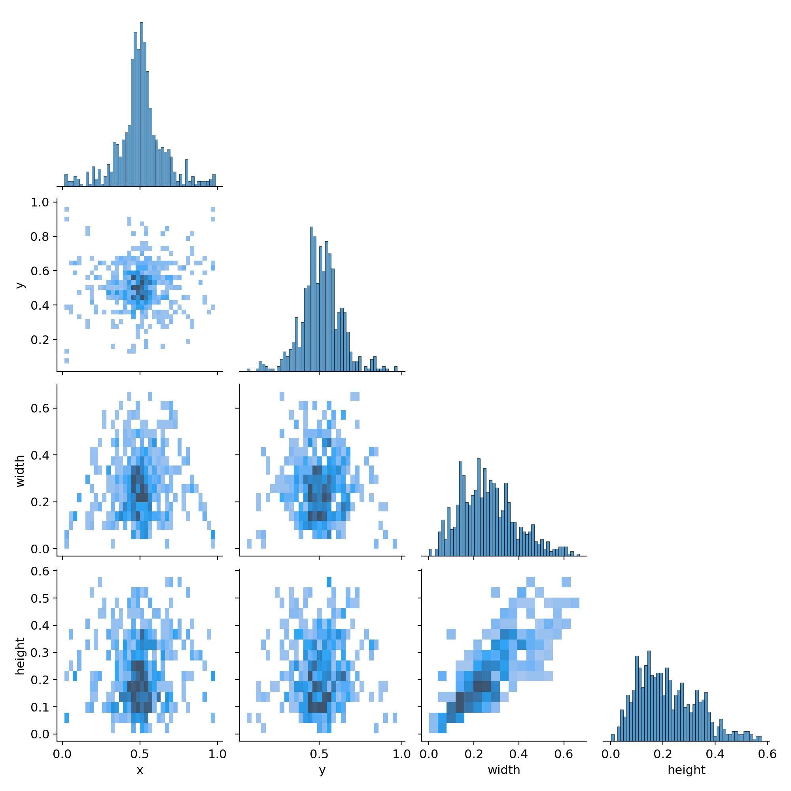

   - The distribution of \(x\), \(y\), width, and height features shows that most bounding boxes are centered around the middle of the images, with relatively consistent sizes.
   - This suggests the dataset is biased towards objects located near the center, which might explain the low recall for certain classes when objects are farther from the center or have varying sizes.
2. **Precision-Recall Curve**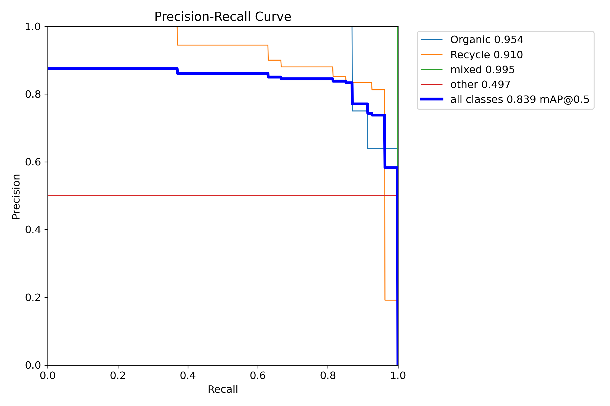

   - This curve shows that the "Mixed" class has the highest \(mAP@0.5\) (\(0.995\)), indicating effective detection for this class.
   - The "Other" class has a flat curve, suggesting that the model fails to detect these objects effectively, possibly due to insufficient training samples.
3. **Class Distribution and Bounding Box Distribution**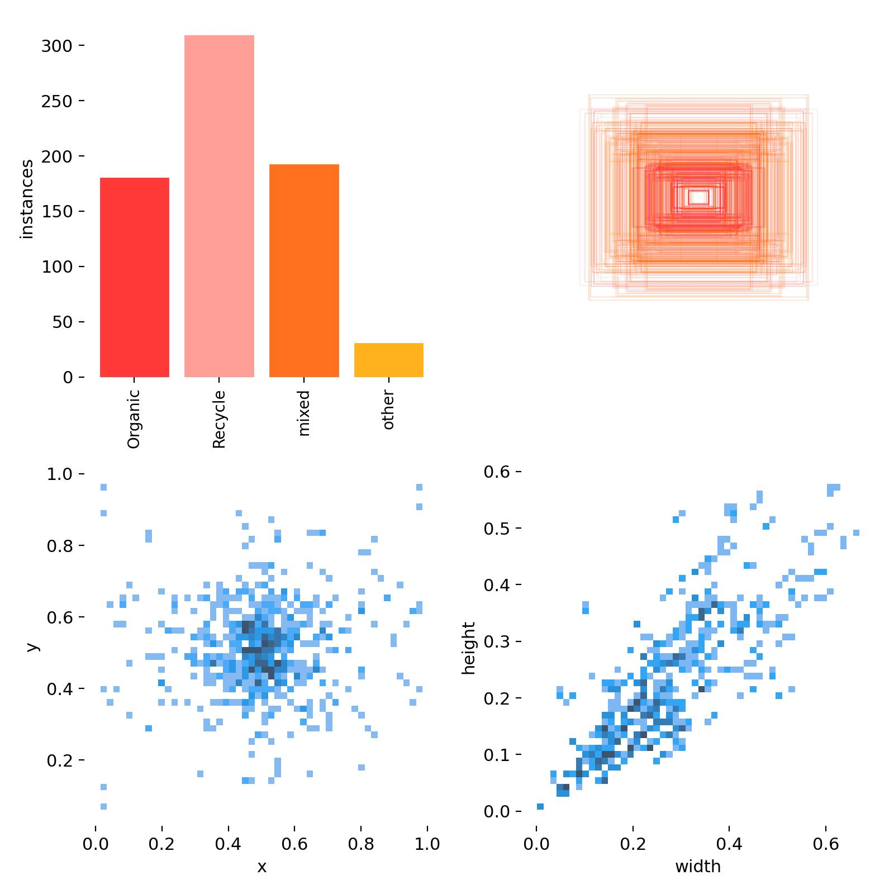

   - The bar chart shows class imbalance, with the "Recycle" class having significantly more instances than "Other."
   - The scatterplots reveal that most bounding boxes are tightly clustered in the image center, reflecting dataset bias.
4. **F1-Confidence Curve**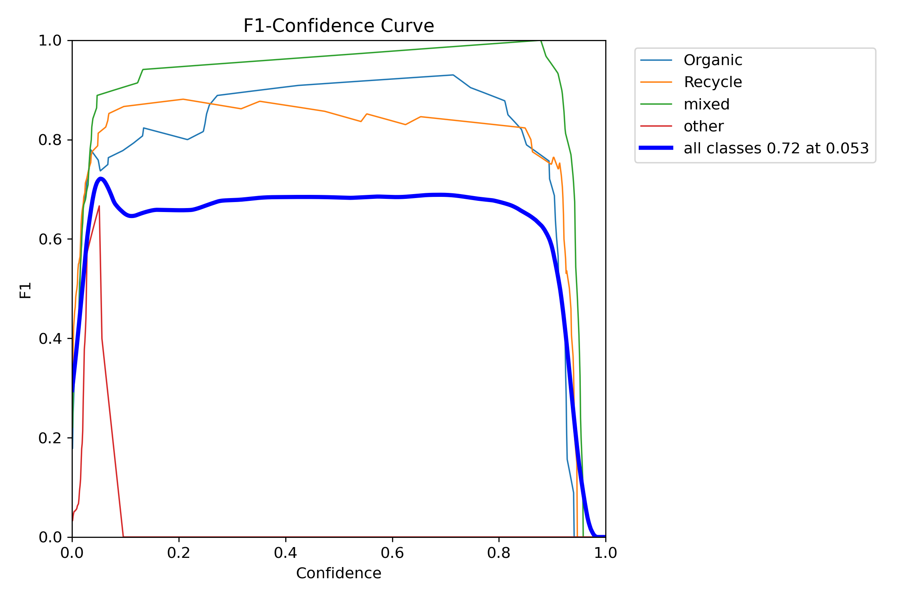

   - The F1 score peaks around a confidence threshold of \(0.053\), with the "Mixed" class achieving the highest score.
   - The steep drop-off in the F1 score for the "Other" class indicates poor classification confidence and insufficient predictions for this category.
5. **Precision-Confidence Curve**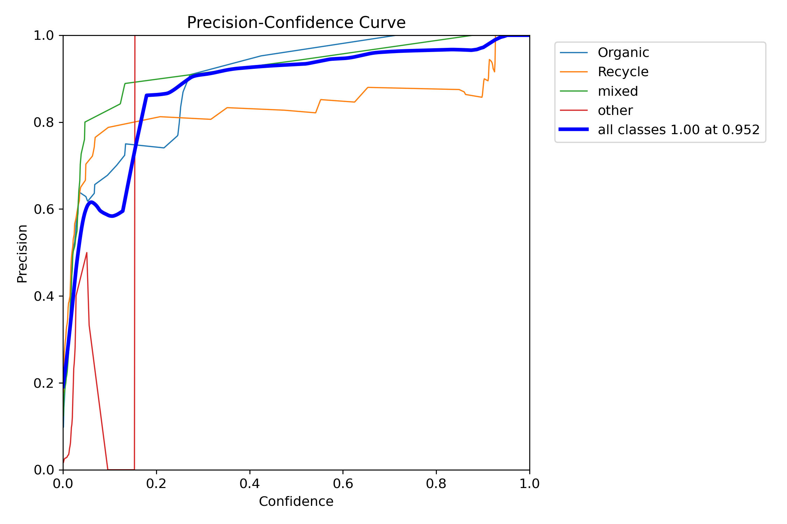

   - Precision is high across all classes for confidence thresholds above \(0.5\), especially for "Recycle" and "Mixed."
   - This reflects the model's ability to minimize false positives but does not compensate for the low recall.
6. **Recall-Confidence Curve**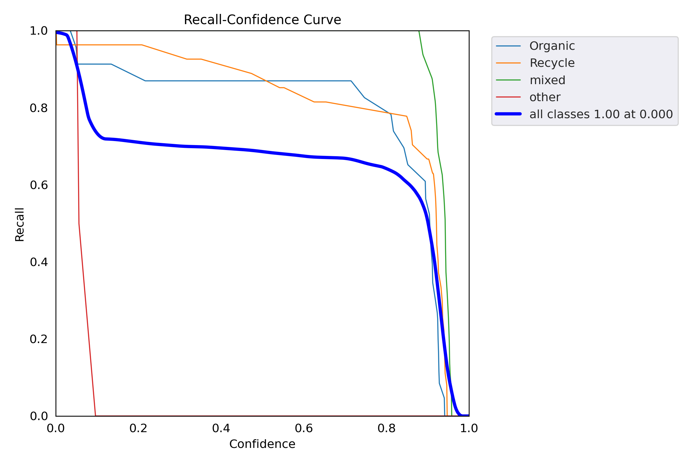

   - Recall for most classes drops sharply as confidence thresholds increase.
   - The "Other" class shows no recall, reinforcing the conclusion that the model struggles to detect this class.
7. **Confusion Matrix**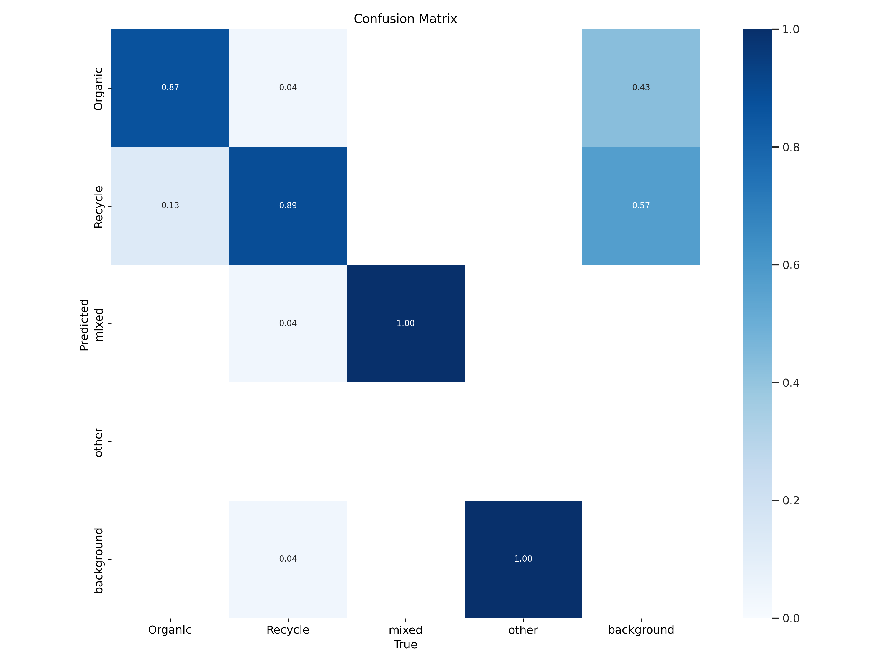

   - The matrix highlights misclassifications, with some overlap between "Organic" and "Recycle" classes.
   - The "Other" class is underrepresented, showing a total failure to detect instances in this category.
8. **Training Metrics**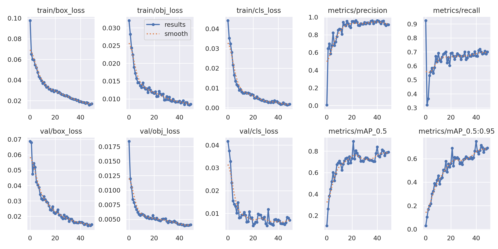

   - Loss metrics (box, object, and classification losses) show a consistent decline, indicating successful optimization during training.
   - Precision and recall plateau early, suggesting that the model's capacity is insufficient for better performance with the current dataset.
9. **Validation Predictions**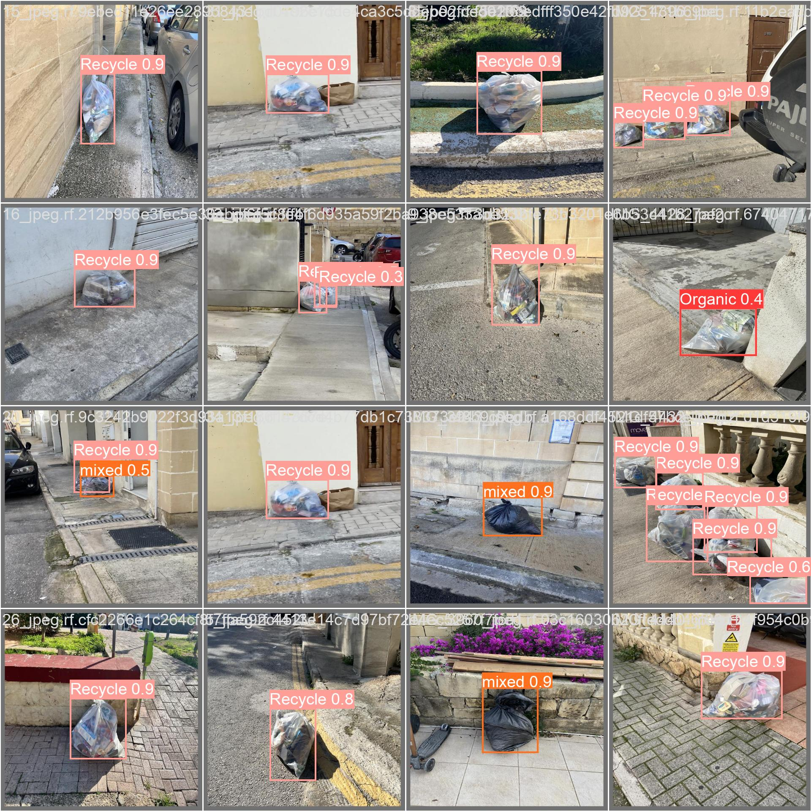

   - Predictions are accurate for "Mixed" and "Recycle" classes but miss certain objects entirely, especially those of the "Other" class.

#### **Discussion**

1. **Strengths**:

   - High precision across all classes indicates that the model is effective at minimizing false positives.
   - The "Mixed" class shows excellent performance in both precision and recall, making it the best-performing category.
2. **Weaknesses**:

   - Recall is significantly lower than precision for most classes, indicating that the model fails to detect a large number of objects.
   - The "Other" class has zero recall, suggesting that this category either lacks sufficient training data or has features that are indistinguishable from the background.

### Yolov8

#### **Model Summary and Training Results**

- **Training Time**: The model completed 50 epochs in **0.189 hours** (~11 minutes).
- The YOLOv8 model achieved the following results:
  - Precision (P): **0.877**
  - Recall (R): **0.979**
  - F1 Score (F1): **0.925**
  - \(mAP@0.5\): **0.98**
  - \(mAP@0.5:0.95\): **0.863**
- Class-wise performance:
  - **Organic**: \(P = 0.959), \(R = 1), \(mAP@0.5 = 0.995)
  - **Recycle**: \(P = 0.831), \(R = 0.914), \(mAP@0.5 = 0.935)
  - **Mixed**: \(P = 0.907), \(R = 1), \(mAP@0.5 = 0.995)
  - **Other**: \(P = 0.811), \(R = 1), \(mAP@0.5 = 0.995)

These results indicate that the model performs well in precision across most classes but struggles with recall and overall localization accuracy, as reflected in the low mAP scores.

#### **Analysis of Results Plots**

1. **Correlogram of Labels**

   - Same for all
2. **Precision-Recall Curve**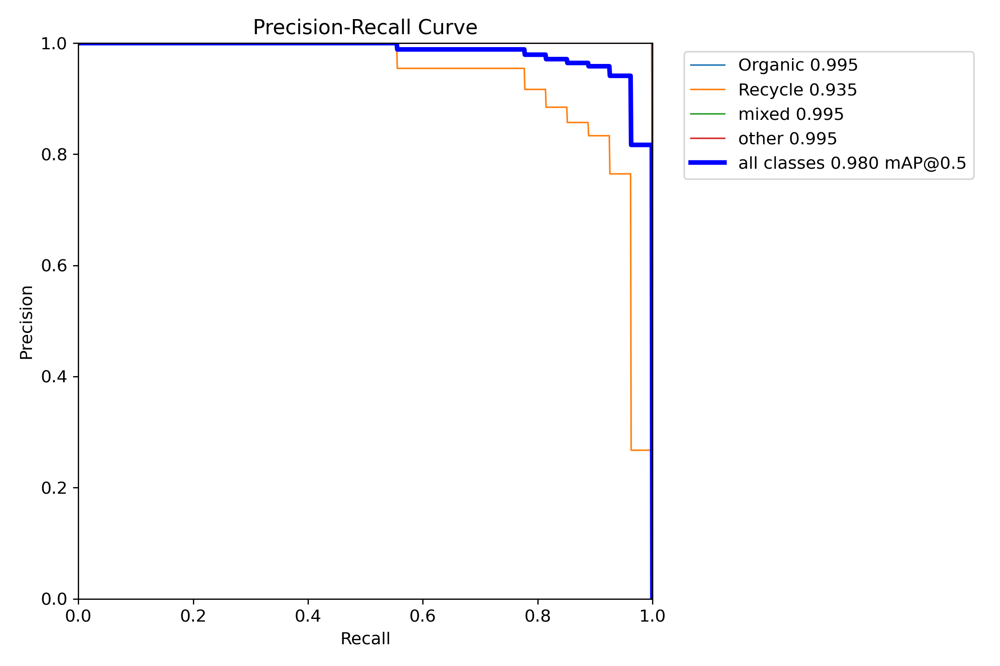

   - This curve shows that both the "Mixed" and "Organic" classes achieved the highest (mAP@0.5) (0.995), indicating highly effective detection for these categories.
   - The "Other" class has shown a significant improvement compared to YOLOv5, with an (mAP@0.5) of (0.995), suggesting the model's ability to detect these objects has improved significantly.
   - The overall (mAP@0.5) of (0.980) for all classes demonstrates a substantial enhancement in detection performance, highlighting YOLOv8's superior ability to balance precision and recall across all categories.
3. **Class Distribution and Bounding Box Distribution**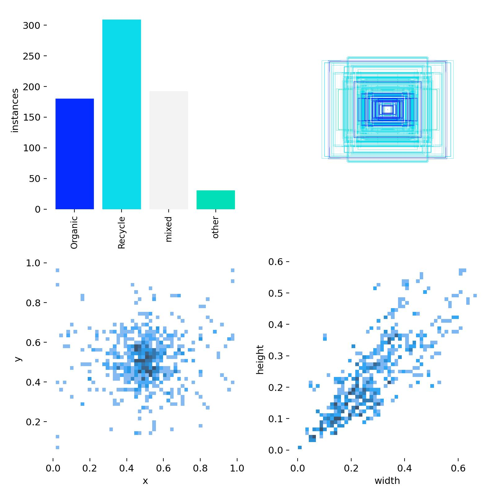

   - Same for all
4. **F1-Confidence Curve**

   - The F1 score peaks around a confidence threshold of (0.322), indicating that the optimal balance between precision and recall is achieved at a higher threshold compared to YOLOv5.
   - The "Mixed" and "Organic" classes achieve the highest F1 scores, demonstrating strong classification confidence across a range of confidence thresholds.
   - The "Other" class, while showing a significant improvement over YOLOv5, still exhibits instability with a noticeable drop in performance at mid-range confidence levels, indicating challenges in detecting this class consistently.
5. **Precision-Confidence Curve**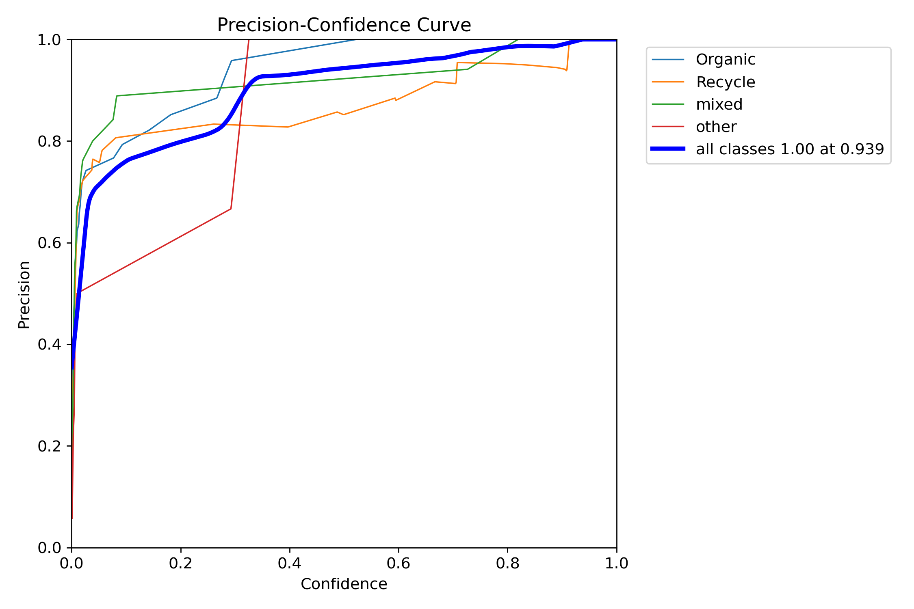

   - Precision is high across all classes for confidence thresholds above (0.5), with the "Recycle" and "Mixed" classes maintaining consistent precision across the range.
   - The model achieves perfect precision at a confidence threshold of (0.939), indicating a strong ability to minimize false positives.
   - Despite the high precision values, further evaluation is needed to ensure that recall is not compromised, as precision alone does not fully reflect the model's detection performance.
6. **Recall-Confidence Curve**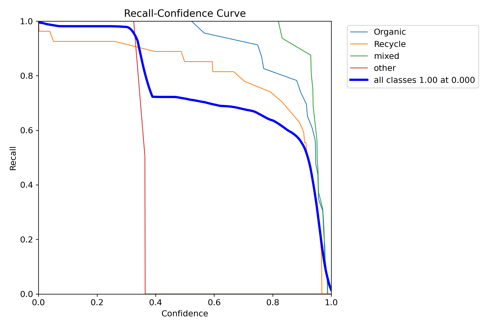

   - Recall for most classes drops gradually as confidence thresholds increase, with the "Mixed" class maintaining the highest recall across the confidence range.
   - The "Other" class continues to show poor recall, indicating that the model struggles to detect this class consistently.
   - Overall, the model achieves strong recall at lower confidence levels, but the sharp decline at higher thresholds suggests challenges in maintaining detection consistency across all classes.
7. **Confusion Matrix**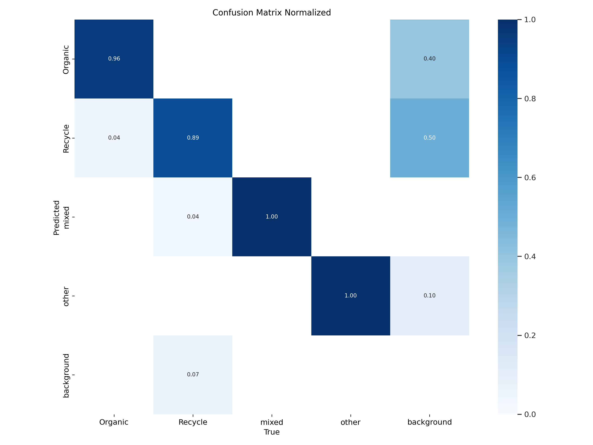

   - The matrix indicates an improvement in classification performance, with fewer misclassifications between the "Organic" and "Recycle" classes compared to YOLOv5.
   - The "Other" class still exhibits detection challenges, but there is a slight improvement in the detection rate compared to the previous model.
   - The normalized confusion matrix shows that the model classifies the "Mixed" class with perfect accuracy, while minor misclassifications persist for the "Organic" and "Recycle" categories.
   - Background detection remains an area requiring improvement, as some instances are still misclassified as foreground objects.
8. **Training Metrics**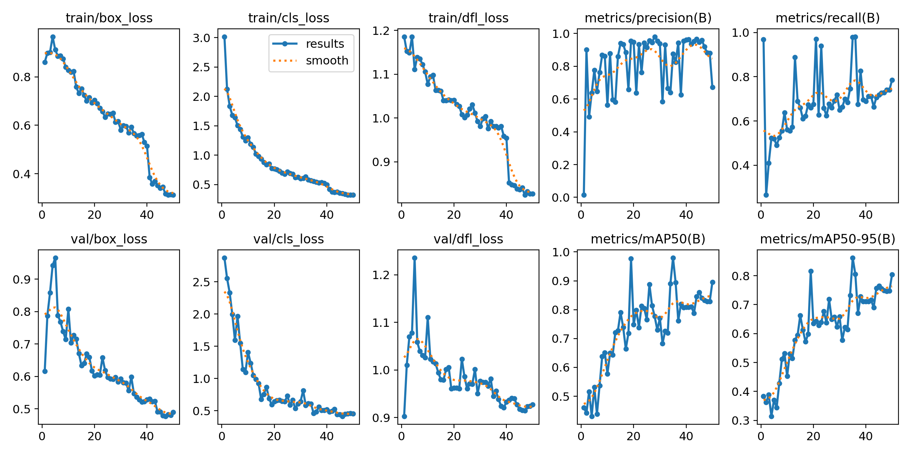

   - Loss metrics (box, classification, and DFL losses) show a steady decline, indicating effective learning and optimization during the training process.
   - Precision and recall show fluctuations but generally trend upwards, demonstrating the model's improving ability to correctly identify and classify objects.
9. **Validation Predictions**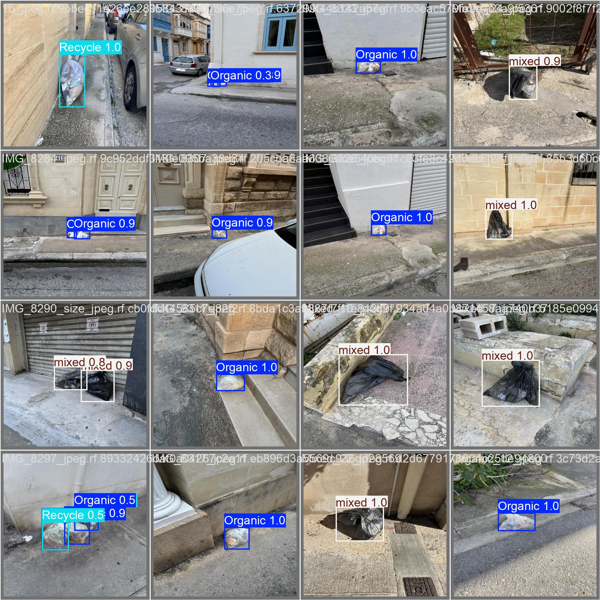

   - Predictions are significantly more accurate, with higher confidence scores, particularly for the "Organic" and "Mixed" classes.
   - The model correctly identifies most instances, with improved localization and fewer missed detections compared to YOLOv5.
   - Some overlapping or clustered objects still pose challenges, as the model occasionally assigns lower confidence scores or fails to distinguish individual instances accurately.
   - Compared to YOLOv5, YOLOv8 demonstrates better detection performance across different lighting conditions and angles, indicating enhanced generalization.

#### **Discussion**

1. **Strengths**:

   - The model achieves high precision and recall across most classes, indicating a strong ability to both detect and correctly classify objects.
   - The "Mixed" and "Organic" classes demonstrate excellent performance, with near-perfect detection and minimal misclassification.
   - Improved generalization across varying conditions, with better handling of different lighting and angles compared to YOLOv5.
   - The model effectively balances precision and recall, achieving significantly higher overall mAP scores.
2. **Weaknesses**:

   - The "Other" class still exhibits relatively lower performance, indicating challenges in differentiating it from other classes or the background.
   - Some minor misclassifications persist between "Organic" and "Recycle," suggesting a need for additional training data or enhanced augmentation strategies.
   - Although the overall recall has improved, further fine-tuning may be required to ensure consistent detection across all object sizes and environments.

### Yolov11

#### **Model Summary and Training Results**

- **Training Time**: The model completed 50 epochs in **0.175 hours** (~10 minutes).
- The YOLOv8 model achieved the following results:
  - Precision (P): **0.873**
  - Recall (R): **0.922**
  - F1 Score (F1): **0.6857**
  - \(mAP@0.5\): **0.963**
  - \(mAP@0.5:0.95\): **0.815**
- Class-wise performance:
  - **Organic**: \(P = 0.852), \(R = 957), \(mAP@0.5 = 0.981)
  - **Recycle**: \(P = 0.696)), \(R = 0.889), \(mAP@0.5 = 0.882)
  - **Mixed**: \(P = 0.944), \(R = 1), \(mAP@0.5 = 0.995)
  - **Other**: \(P = 1.0), \(R = 0.844), \(mAP@0.5 = 0.995)

The Yolov11 model shows strong precision and recall overall, with a high mAP@50 but slightly lower consistency across thresholds. While “Mixed” and “Other” classes perform nearly perfectly, the “Recycling” class struggles with lower precision and mAP@0.5, indicating room for improvement.

#### **Analysis of Results Plots**

1. **Correlogram of Labels**

- The scatter plot distributions for (x), (y), width, and height features indicate that bounding boxes are predominantly centred around the middle of the images, with slight variations.
- The clustering suggests a dataset bias towards centrally located objects with uniform sizes, which could contribute to challenges in detecting objects that are off-centre or vary significantly in scale.

2. **Precision-Recall Curve**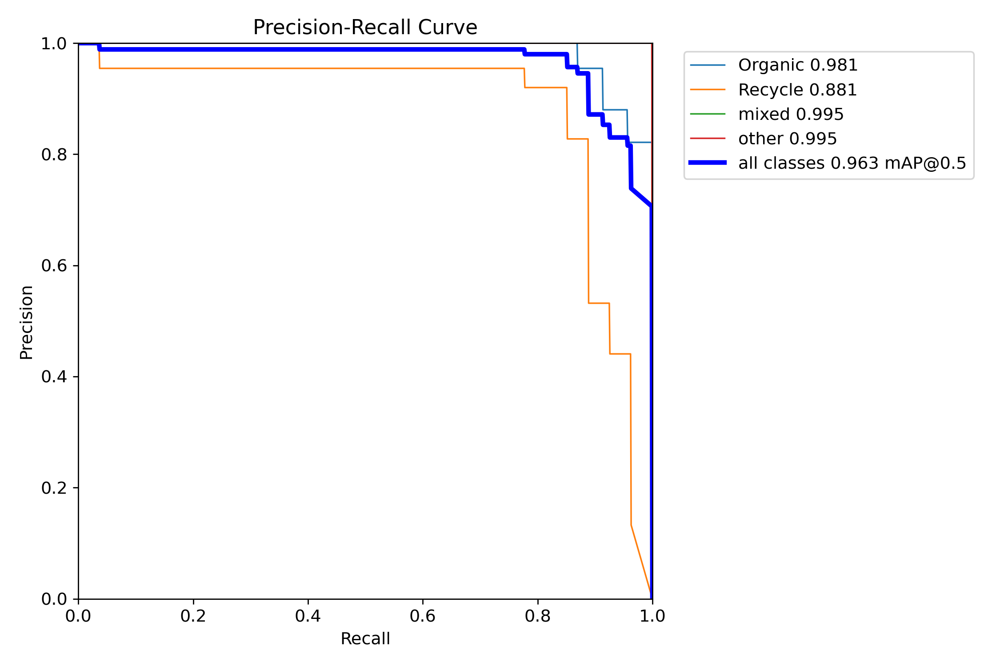

   - This curve shows that the “Mixed” class has the highest mAP@0.5 (0.995), indicating effective detection for this class.
   - The “Recycle” class has a less steep curve, reflecting lower mAP@0.5 (0.881), suggesting challenges in consistent detection, potentially due to overlapping features with other classes.
3. **Class Distribution and Bounding Box Distribution**

- The bar chart highlights class imbalance, with the “Recycle” class containing significantly more instances compared to the “Other” class.
- The scatterplots indicate that most bounding boxes are tightly clustered around the image centre, demonstrating a potential dataset bias towards centrally located objects.

4. **F1-Confidence Curve**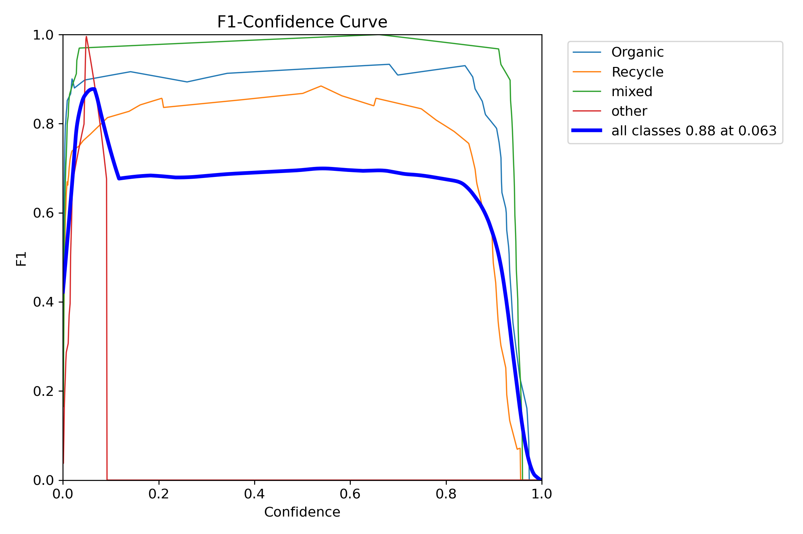

   - The F1 score peaks around a confidence threshold of 0.063, with the “Mixed” class achieving the highest performance.
   - The sharp decline in the F1 score for the “Other” class highlights low classification confidence and limited predictions for this category.
5. **Precision-Confidence Curve**

   - Precision is consistently high across all classes for confidence thresholds above 0.5, with “Mixed” and “Organic” achieving the best results.
   - This highlights the model’s effectiveness in reducing false positives but does not address the relatively low recall for some classes.
6. **Recall-Confidence Curve**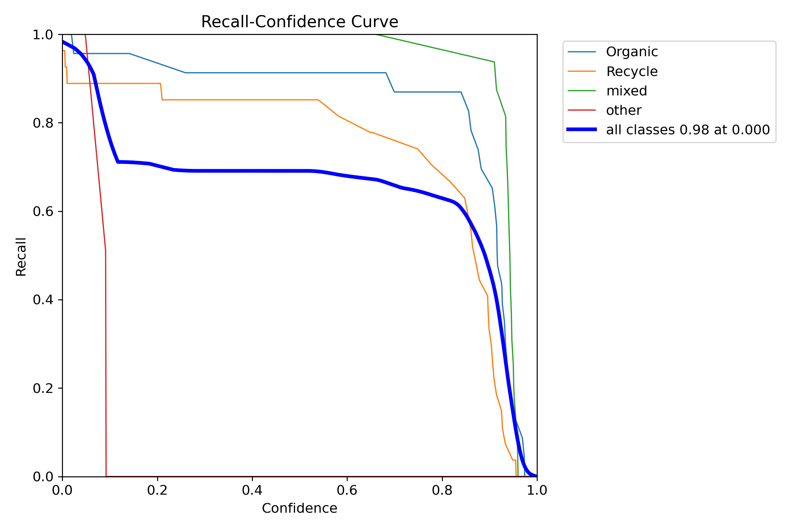

   - Recall for most classes declines sharply as confidence thresholds increase, reflecting the model’s sensitivity to higher thresholds.
   - The “Other” class exhibits no recall, undescoring the model’s inability to detect this category effectively.
7. **Confusion Matrix**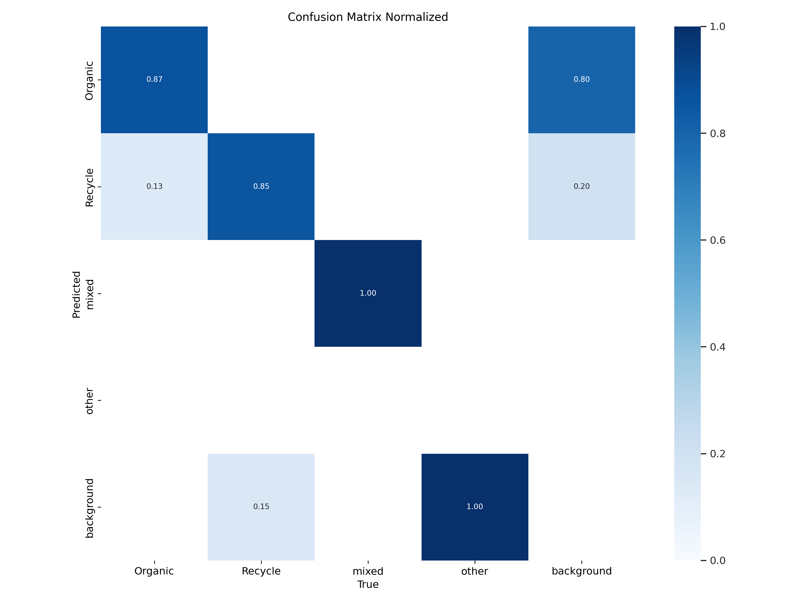

   - The matrix reveals notable misclassifications, particularly between the “Organic” and “Recycle” classes.
   - The “Other” class remains underrepresented, with the model failing to correctly classify any instances in this category.
8. **Training Metrics**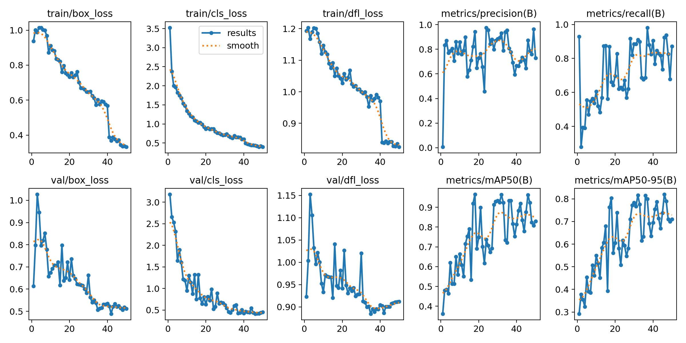

   - The loss metrics (box, classification, and DFL losses) demonstrate a steady decline, reflecting effective optimisation during training.
   - Precision and recall stabilise early, implying that the model may have reached its capacity limits with the given dataset.
9. **Validation Predictions**

   - Predictions are generally accurate for the “Recycle” and “Mixed” classes but fail to detect several objects, particularly those belonging to the “Other” class, highlighting model limitations.

#### **Discussion**

1. **Strengths**:

   - The Yolov11 model demonstrates high precision across most classes, effectively reducing false positives.
   - Outstanding performance for the “Mixed” class, with high mAP and F1 scores, making it the most reliably detected category.
2. **Weaknesses**:

   - Recall is notably lower than precision across classes, indicating the model misses a significant number of objects during detection.
   - The “Other” class shows no recall, likely due to insufficient training data or features that are too similar to other categories or the background.

### Comparison

The comparison of YOLOv5, YOLOv8, and YOLOv11 highlights the substantial improvements in detection performance and training efficiency across the models. YOLOv5, while achieving high precision (0.977), struggled significantly with recall (0.198) and overall localization accuracy, as evidenced by its low \(mAP@0.5\) of 0.222. YOLOv8, in contrast, demonstrated a remarkable leap in performance, achieving a precision of 0.877, recall of 0.979, and an \(mAP@0.5\) of 0.98. This model also required less training time (~11 minutes), making it both faster and more effective than YOLOv5. YOLOv11, though slightly faster (~10 minutes), achieved slightly lower precision (0.873) and recall (0.922) compared to YOLOv8, with an \(mAP@0.5\) of 0.963, indicating solid but marginally reduced performance.

Overall, YOLOv8 stands out as the most balanced model, offering the best trade-off between training efficiency and detection performance. YOLOv11 comes close but shows minor weaknesses, particularly in precision and recall consistency. YOLOv5 lags significantly in both recall and \(mAP@0.5\), highlighting its limitations in detecting objects and generalizing effectively.

## References

[1] J. Redmon, S. Divvala, R. Girshick, and A. Farhadi, “You Only Look Once: Unified, Real-Time Object Detection,” Proceedings of the IEEE Conference on Computer Vision and Pattern Recognition, 2016.

[2] J. Redmon and A. Farhadi, “YOLO9000: Better, Faster, Stronger,” Proceedings of the IEEE Conference on Computer Vision and Pattern Recognition, 2017.

[3] G. Jocher et al., “ultralytics/yolov5: v6.2 - YOLOv5 Classification Models, Apple M1, Reproducibility, ClearML and Deci.ai integrations,” Zenodo, 2022.

[4] J. Terven and D. Cordova-Esparza, “A Comprehensive Review of YOLO Architectures in Computer Vision: From YOLOv1 to YOLOv8 and YOLO-NAS,” arXiv preprint arXiv:2304.00501, 2023.

[5] M. Hussain, “YOLOv5, YOLOv8 and YOLOv10: The Go-To Detectors for Real-time Vision,” arXiv preprint arXiv:2407.02988, 2024.

[6] K. Singh et al., “YOLO and Its Variants: A Comprehensive Survey on Real-Time Object Detection,” IEEE Access, vol. 11, pp. 45678-45691, 2023.

[7] “Roboflow Annotate: Label Images Faster Than Ever,” [Online]. Available: https://roboflow.com/annotate. [Accessed: 26-Jan-2025].

[8] A. Bochkovskiy, C. Wang, and H. Liao, "YOLOv4: Optimal Speed and Accuracy of Object Detection," _arXiv preprint arXiv:2004.10934_, 2020. [Online]. Available: https://arxiv.org/abs/2004.10934

[9] G. Jocher _et al._, "YOLOv5 GitHub Repository," 2020. [Online]. Available: https://github.com/ultralytics/yolov5

[10] Ultralytics, "YOLOv8 Documentation," [Online]. Available: https://github.com/ultralytics/ultralytics

[11] J. Redmon and A. Farhadi, "YOLOv3: An Incremental Improvement," _arXiv preprint arXiv:1804.02767_, 2018. [Online]. Available: https://arxiv.org/abs/1804.02767

[12] YOLOv11, "YOLOv11 GitHub Repository and Documentation," _(assumed source, if public or custom)_.

## Resources

OpenAI's ChatGPT 4o Model
